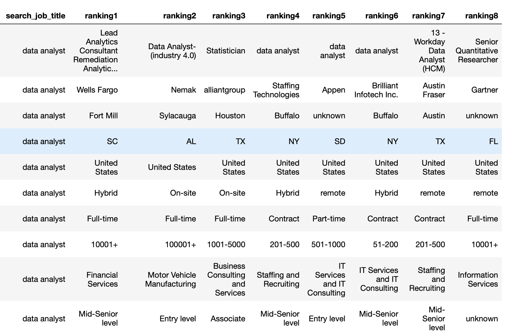
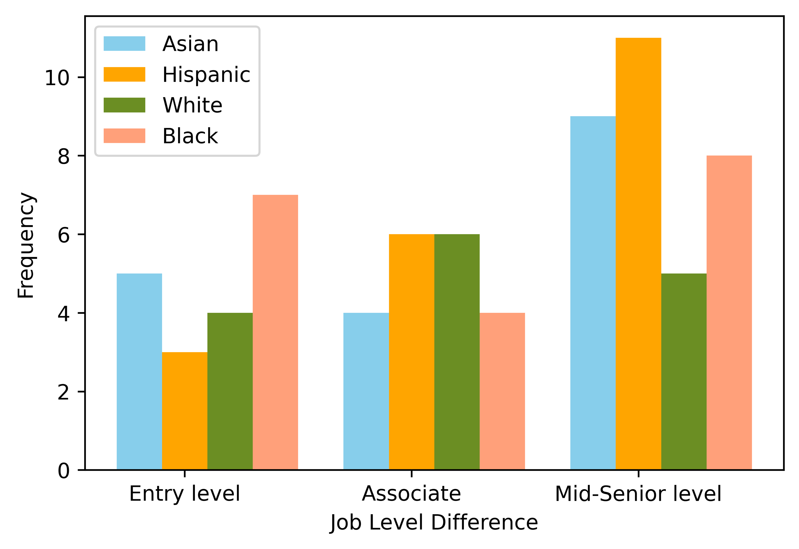
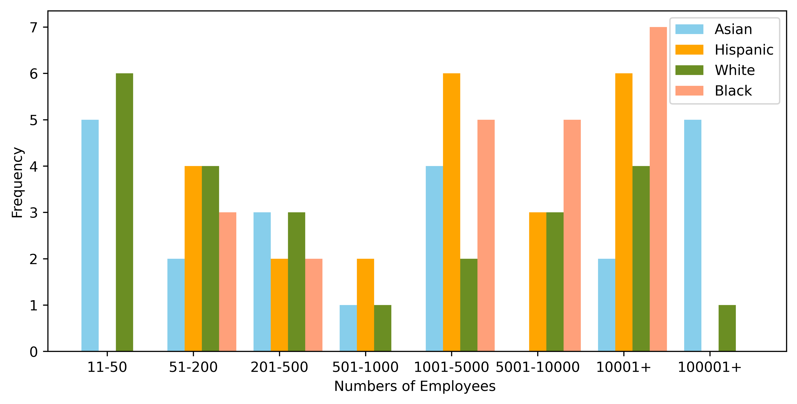
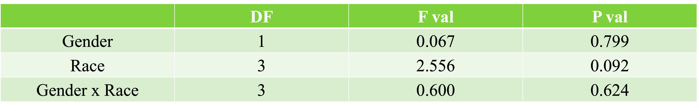

# Website Link: https://sawadhwa.github.io/

## Introduction
   
   The project code can be found here: [https://github.com/NJMIXI98/DSC180_Q2PROJECT](https://github.com/NJMIXI98/DSC180_Q2PROJECT.git)

   In the twentieth century, one of sociology’s findings is that race and gender matter in the job market. Jobs were segregated by race and gender with whites earning more than other people of color and men earning more than women. Race inequality in the job market has been a long-standing interest of scholars. Notably, some research indicates that racial gaps are more significant for women than for men. Women face the unique challenges of lower wages and lower rewards in the global workforce. However, as women’s relative share in occupations grows nowadays, the gender inequality gap narrows in most job markets(Stier et al.,2014). Besides, a finding shows that race-based discrimination is weaker in high-paid jobs. Back in 2012, the Harvard Business Review acclaimed data science as “the sexiest job of the 21st century”. Some may pose the question of whether the statement still holds today. According to the U.S. BUREAU of Labor Statistics, employment in data science is projected to grow 36% from 2021 to 2031, much faster than the average for all occupations, which means employers will create more than 13,500 new data science related job opportunities each year on average, over the decade(Bureau of Labor Statistics 2022). Thus, we are curious about gender-based and race-based inequality in data science. The inequality that we are going to study consists of racial and gender discrimination in data science employment. There has been previous work related to these problems (gender and racial bias in general employment) but not in a specific field job market. The null hypothesis that we will be testing is that there is no race and gender inequality in the dataset that we are going to collect. Our study will be trying to decipher whether we want to accept or reject the null hypothesis by using an ANOVA test.
Our first step will be collecting as much as possible data and then cleaning it. We will then start to analyze the data through a descriptive analysis where we will mathematically describe and summarize the data that we found. Next, we will undergo diagnostic analysis where we will study the different rates of employment in the data science field for different genders and races. Finally, we will use visual analysis to communicate our findings.

## Methods

   We started out our project by compiling all the data that we needed for our tests. We gathered this data by using a job recommendation website where we gathered data for 12 male subjects and 12 female subjects. For each gender, we gathered data within 4 different races (white, black, hispanic, asian). Some of the attributes that we gathered included the location of the recommended job, whether the job was remote, whether the job was full-time, how many employees were at this specific job, what type of field this job was in and what position was being offered. Some secondary attributes that we collected included what the main responsibilities of the job were for the employee and what the positional requirements were for the job.
   The three attributes that we decided to focus on were what position was being offered (level of the job), how many employees were at the offered job and the type of job was being offered. The first two attributes would help us decipher what level of job was being offered to each race and each gender. Meanwhile, the type of job attribute would help us analyze the different jobs that are being offered to the different types of races and genders we are looking at. 
   Our main method that we used was an ANOVA test. We summed up the counts for each of the three attributes which were level, employees and type. We used a bar plot to represent the employee counts for each range of employees and pie plots to represent the level and type attributes.
	
## Data 

   The data that we collected came from a job recommendation website. For each unique profile, we collected the location, work status, job level, numbers of company employees, job field, offered position, main responsibilities and positional requirements of the recommended job.
   
   The full dataset can be found here: [https://github.com/NJMIXI98/DSC180_Q2PROJECT](https://github.com/NJMIXI98/DSC180_Q2PROJECT/tree/main/q2_dataset)
  
   A snippet of one of the profiles can be found below:
   
   
This is one of the example datasets for the recommendations for an Asian woman
 

   

    

   
## Results

   As we began our ANOVA test, the first attribute that we looked at was the job level difference that was offered by different companies between the different races. As you can see in Figure 1 below, we found that the Hispanic people actually received the highest level of jobs at the mid-senior level followed by the Asian people, Black people and White people. 
   The next attribute we looked at was the number of employees of these companies which would also help us judge the level of jobs each race received from the potential employer. As you can see in Figure 2 below, we found that the jobs with the most employees were offered mostly to Black and Hispanic people. The White and Asian people alternated who was higher depending on our selected ranges.
   The third attribute that we studied was the type of jobs that were offered to each gender and race. This attribute gave us varied results and there wasn’t one consecutive pattern throughout each race or even each gender. For some races, the higher level job offers were received more by the women than the men. However, some of the other races had the men receive the higher level jobs so there was no obvious pattern.
   The statistical results of our two-way ANOVA test which used an average job level of ranked recommendation which was dependent on the applicant’s gender and race (ethnicity) in an online job market website gave us different results for each measure. For the p-value for the gender test, we received a value of 0.799. Meanwhile, for the p-value for the race test, we received a value of 0.092. Finally, for the p-value of the race and gender test, we received a value of 0.6.
   
   
Figure 1: The distribution of job level difference for 
each race
 

   

    

   
  
Figure 2: The distribution of numbers of the company employees for each race

 

   

    

 

   
   
Table 1: The results of a two-way ANOVA test with the average job level of ranked recommendation seen as dependent on the applicant’s gender and race(ethnicity) in online job market website. n=16

 

  

    

   
## Discussion

   In our project, we tried to discover if gender and racial bias was present in data science employment. According to our results, our test failed to reject the null hypotheses. We calculated this by using a two-way ANOVA test using average job level as our dependent variable meanwhile race and gender served as our independent variables. The result shows that none of our three tests (gender, race, race + gender) show any type of inequality. The reason why we are rejecting our hypotheses is because none of our p-values was under the standard 0.05 level. However, if we used the 0.1 level of significance, there might have been some differential treatment when it came to race. That level of significance is a very weak indicator so we decided to keep our original results. 
   One of the biggest limitations that we saw in our study was our limited ability to analyze small differences. So many of our differences were miniscule so it's tough to discern if this is a strong effect or not. The most obvious limitation is that we need more data for a multitude of reasons. The biggest reason for more data is that a sample size of 24 people is not enough. Another reason is that we need to try to collect more data because it would help in catching any confounding variables. The trouble we had reproducing the same dataset is that there are some variables that are inconsistent between data points and the data is tough to collect in general. Our main goal in future studies is that we hope we are able to enlighten people on the possible inequality that seems to be prevalent in one of the up and coming fields in American employment. 

### References

Bureau of Labor Statistics, U.S. Department of Labor, Occupational Outlook Handbook, Data Scientists,
at https://www.bls.gov/ooh/math/data-scientists.htm (visited November 28, 2022)

Stier, H., & Yaish, M. (2014). Occupational segregation and gender inequality in job quality: a multi-level approach. Work, Employment and Society, 28(2), 225–246. https://doi.org/10.1177/0950017013510758
